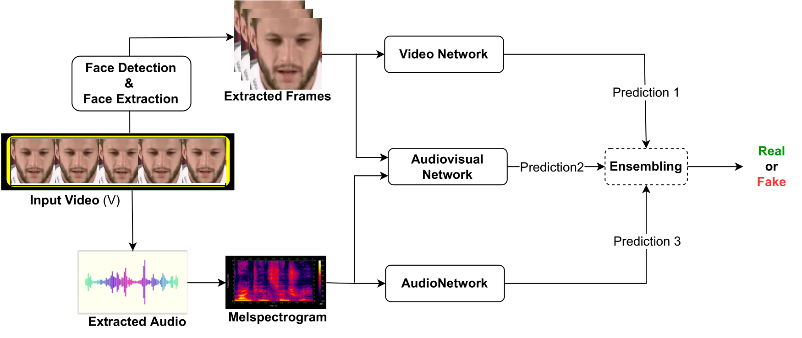

# Multimodal Forgery Detection Using Ensemble Learning

 - [Introduction](#Introduction)
 - [Getting Started](#Getting-Started)
 - [Citing](#Citing)  
 - [Contact](#Contact)
## Introduction

This repository contains the official implementation (PyTorch) of [(__Multimodal Forgery Detection 
Using Ensemble Learning__)](http://www.apsipa.org/proceedings/2022/APSIPA%202022/ThAM1-6/1570840386.pdf) proposed in APSIPA Paper 2022 (Ammarah Hashmi, Sahibzada Adil Shahzad).

In this paper, we focus on the multimodal forgery detection task and propose a deep forgery detection 
method based on audiovisual ensemble learning. The proposed method consists of four parts, namely a 
Video Network, an Audio Network, an Audiovisual Network, and a Voting Module. 

Given a video, the proposed multimodal and ensemble learning system can identify whether it is fake 
or real. 



Experimental results on a recently released multimodal (__FakeAVCeleb dataset__) show that the proposed method achieves 89% accuracy, significantly
outperforming existing models.

You can access the FakeAVCeleb Dataset through this [dataset site](https://sites.google.com/view/fakeavcelebdash-lab/).

Please click the link to access the [poster](https://www.researchgate.net/publication/365995495_Multimodal_Forgery_Detection_Using_Ensemble_Learning) of the paper.

## Getting Started

Code is releasing Soon...!

## Citing

If you find our repository useful, please consider giving a ⭐ and cite our [paper](http:link).

```bibtex
@inproceedings{hashmi2022multimodal,
  title={Multimodal Forgery Detection Using Ensemble Learning},
  author={Hashmi, Ammarah and Shahzad, Sahibzada Adil and Ahmad, Wasim and Lin, Chia Wen and Tsao, Yu and Wang, Hsin-Min},
  booktitle={2022 Asia-Pacific Signal and Information Processing Association Annual Summit and Conference (APSIPA ASC)},
  pages={1524--1532},
  year={2022},
  organization={IEEE}
}
```
## Contact

If you have any question, feel free to send an email at hashmiammarah0@gmail.com .

